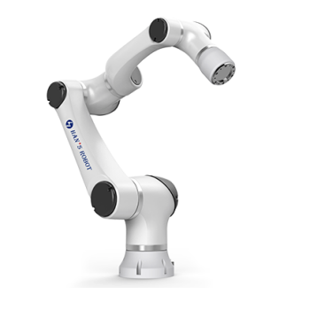

Dual Elfin Robot
======




本文件夹中包含了Elfin双臂机器人提供ROS支持的仿真软件包。推荐的运行环境为 Ubuntu 16.04 + ROS Kinetic 或 Ubuntu 18.04 + ROS Melodic，其他环境下的运行情况没有测试过。

**安装本软件包**

首先创建catkin工作空间 ([教程](http://wiki.ros.org/catkin/Tutorials))。 然后将本文件夹克隆到src/目录下，之后用catkin_make来编译。  
假设你的工作空间是~/catkin_ws，你需要运行的命令如下：
```sh
$ cd ~/catkin_ws/src
$ git clone https://github.com/hans-robot/dual_elfin_robot.git
$ cd ..
$ catkin_make
$ source devel/setup.bash
```

---

## 注意：
### 在使用Moveit进行双臂仿真时，请勿在机械臂未完成运动之前切换规划组，否则会造成Moveit的死锁异常！！！

---

### 使用仿真模型

***下面给出的是启动Elfin3的一系列命令。***

用Gazebo仿真请运行：
```sh
$ roslaunch elfin_arms_gazebo elfin3_empty_world.launch
```

运行MoveIt!模块, RViz界面:
```sh
$ roslaunch dual_elfin3_config moveit_planning_execution.launch
```
如果你此时不想运行RViz界面，请用以下命令:
```sh
$ roslaunch dual_elfin3_config moveit_planning_execution.launch display:=false
```

### 说明
本功能包仅作为双臂仿真的参考，暂不支持ROS标准功能包的GUI控制界面和真机控制，对于其他机型可参考本功能包配置，并进行仿真，后续会更新不同机型的双臂功能包；

若需要控制真实双臂机器人，可尝试通过获取Moveit规划出来的轨迹中的轨迹点，配合本机器人的C++标准SDK使用TCP的方式发送给真实机器人的控制器进行控制。